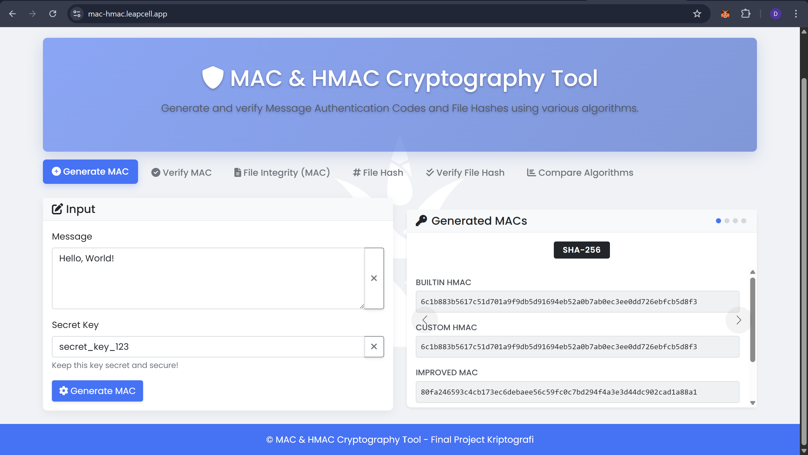
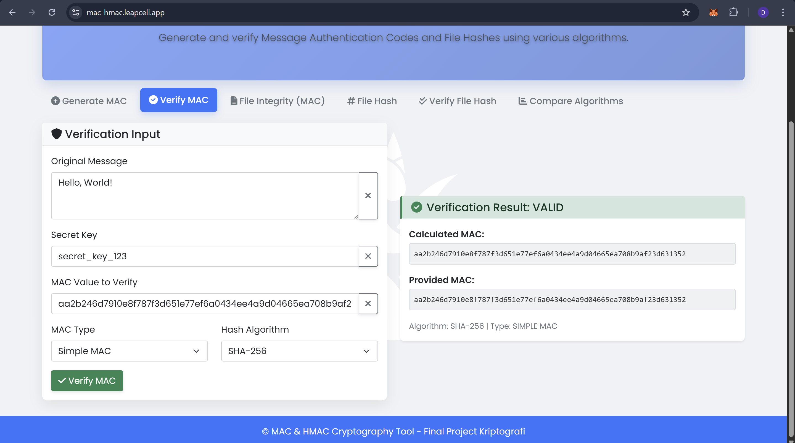
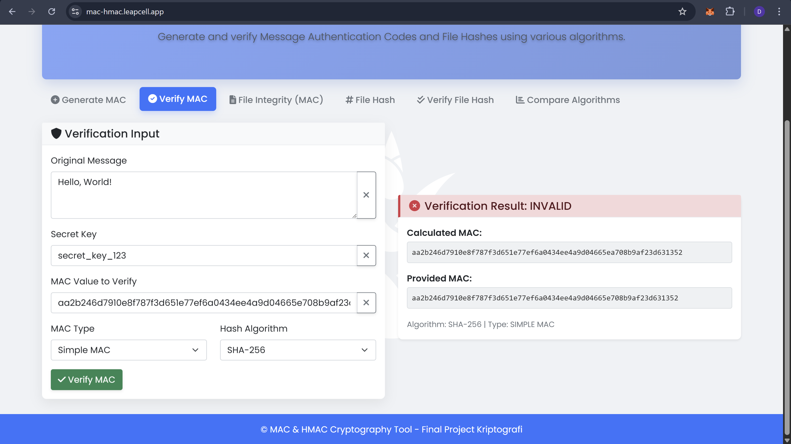

# MAC & HMAC Cryptography Tool

Final Project untuk mata kuliah **Kriptografi** dengan tema **Message Authentication Code (MAC)** dan **Hash-based Message Authentication Code (HMAC)**.

## 📋 Daftar Anggota Kelompok

| Nama                 | NRP        |
| -------------------- | ---------- |
| Daffa Rajendra P     | 5027231009 |
| Muhamad Arrayyan     | 5027231014 |
| Athalla Barka Fadhil | 5027231018 |
| Naufal Syafi Hakim   | 5027231022 |
| RM. Novian Malcolm B | 5027231035 |
| Muhammad Dzaky Ahnaf | 5027231039 |
| Dzaky Faiq Fayyadhi  | 5027231047 |

## 📋 Deskripsi Project

Aplikasi web interaktif yang mengimplementasikan dan mendemonstrasikan konsep MAC dan HMAC dalam kriptografi. Aplikasi ini menyediakan berbagai fitur untuk memahami, menggunakan, dan membandingkan berbagai implementasi MAC dan HMAC.

## 🎯 Tujuan Pembelajaran

1. **Memahami konsep MAC dan HMAC** dalam konteks keamanan informasi
2. **Mengimplementasikan algoritma** MAC dan HMAC dari scratch
3. **Membandingkan berbagai algoritma hash** (MD5, SHA-1, SHA-256, SHA-512)
4. **Menerapkan praktik keamanan** dalam implementasi kriptografi
5. **Mengembangkan aplikasi web** dengan antarmuka yang user-friendly

## 🚀 Fitur Utama

### 1. Generate MAC

- Implementasi Simple MAC: `MAC = H(key || message)`
- Implementasi Improved MAC: `MAC = H(key || H(message))`
- Implementasi Custom HMAC sesuai RFC 2104
- Built-in HMAC menggunakan library Python
- Support multiple hash algorithms (MD5, SHA-1, SHA-256, SHA-512)

### 2. Verify MAC

- Verifikasi autentisitas pesan menggunakan MAC
- Deteksi perubahan pesan atau key
- Comparison antara calculated MAC vs provided MAC
- Support semua jenis MAC yang diimplementasikan

### 3. File Integrity Checking

- Upload file dan generate MAC untuk file integrity
- Deteksi perubahan pada file
- Support berbagai format file (.txt, .md, .json, .csv)

### 4. Algorithm Comparison

- Perbandingan output dari berbagai algoritma hash
- Informasi keamanan dan performa setiap algoritma
- Visualisasi perbedaan output MAC

### 5. Educational Content

- Penjelasan teori MAC dan HMAC
- Formula dan cara kerja HMAC
- Security considerations dan best practices
- Use cases dalam dunia nyata

## 📘 Teori Algoritma Hash

Berikut adalah penjelasan singkat mengenai algoritma hash yang diimplementasikan dalam aplikasi ini. Pemahaman ini penting untuk memilih algoritma yang tepat sesuai kebutuhan keamanan.

### MD5 (Message Digest 5)

- Pengembang: Ronald Rivest (1991)
- Ukuran Output: 128-bit (32 karakter heksadesimal)
- Status Keamanan: Rusak (Broken)
- Deskripsi: MD5 adalah salah satu algoritma hash kriptografi pertama yang digunakan secara luas. Namun, pada tahun 1996, celah keamanan yang serius ditemukan, dan sejak itu MD5 sangat rentan terhadap collision attacks (serangan tabrakan), di mana dua input yang berbeda dapat menghasilkan hash yang sama.
- Penggunaan Saat Ini: Penggunaannya sangat tidak disarankan untuk tujuan keamanan seperti SSL/TLS atau tanda tangan digital. Dalam aplikasi ini, MD5 diimplementasikan hanya untuk tujuan edukasi dan perbandingan historis.

### SHA-1 (Secure Hash Algorithm 1)

- Pengembang: National Security Agency (NSA), AS (1995)
- Ukuran Output: 160-bit (40 karakter heksadesimal)
- Status Keamanan: Ditinggalkan (Deprecated)
- Deskripsi: SHA-1 dirancang untuk memperbaiki kelemahan pada pendahulunya. Selama bertahun-tahun, SHA-1 menjadi standar keamanan web. Namun, kelemahan kriptografis mulai ditemukan pada awal 2000-an. Pada tahun 2017, Google berhasil mendemonstrasikan serangan tabrakan praktis pertama terhadap SHA-1 (dikenal sebagai SHAttered).
- Penggunaan Saat Ini: Sejak 2017, semua browser utama telah berhenti menerima sertifikat SSL yang menggunakan SHA-1. Seperti MD5, SHA-1 disertakan dalam proyek ini untuk tujuan pembelajaran.

### SHA-256 (Secure Hash Algorithm 2 - 256 bit)

- Pengembang: National Security Agency (NSA), AS
- Ukuran Output: 256-bit (64 karakter heksadesimal)
- Status Keamanan: Aman (Secure)
- Deskripsi: SHA-256 adalah bagian dari keluarga SHA-2, yang berisi beberapa ukuran hash yang berbeda. Hingga saat ini, belum ada serangan signifikan yang ditemukan terhadap SHA-256. Algoritma ini menawarkan keseimbangan yang sangat baik antara keamanan dan performa.
- Penggunaan Saat Ini: SHA-256 adalah standar industri saat ini. Ia digunakan secara luas dalam berbagai aplikasi keamanan, termasuk protokol TLS, tanda tangan digital, dan merupakan komponen inti dari blockchain Bitcoin. Ini adalah algoritma yang direkomendasikan untuk sebagian besar kasus penggunaan.

### SHA-512 (Secure Hash Algorithm 2 - 512 bit)

- Pengembang: National Security Agency (NSA), AS
- Ukuran Output: 512-bit (128 karakter heksadesimal)
- Status Keamanan: Sangat Aman (Very Secure)
- Deskripsi: SHA-512 juga merupakan bagian dari keluarga SHA-2. Secara teoretis, ia menawarkan tingkat keamanan yang lebih tinggi daripada SHA-256 karena outputnya yang lebih panjang, membuatnya lebih tahan terhadap serangan brute-force. Menariknya, pada arsitektur CPU 64-bit, SHA-512 seringkali lebih cepat daripada SHA-256 karena memanfaatkan ukuran word prosesor yang lebih besar.
- Penggunaan Saat Ini: Digunakan dalam aplikasi yang memerlukan jaminan keamanan tertinggi. Direkomendasikan jika performa pada sistem 64-bit menjadi prioritas dan keamanan jangka panjang sangat penting.

## 🛠️ Teknologi yang Digunakan

- **Backend**: Python 3.8+, Flask
- **Frontend**: HTML5, CSS3, JavaScript, Bootstrap 5
- **Cryptography**: hashlib, hmac (built-in Python libraries)
- **UI Framework**: Bootstrap 5, Font Awesome icons
- **Testing**: Custom test suite

## 📦 Struktur Project

```
mac-hmac-crypto-tool/
├── app.py                 # Main Flask application
├── requirements.txt       # Python dependencies
├── test_mac_hmac.py      # Test suite
├── templates/
│   ├── base.html         # Base template
│   ├── index.html        # Main application interface
│   └── educational.html  # Educational content
└── README.md             # Project documentation
```

## 🔧 Instalasi dan Setup

### Prerequisites

- Python 3.8 atau lebih baru
- pip (Python package manager)

### Langkah Instalasi

1. **Clone atau download project**

   ```bash
   # Jika menggunakan git
   git clone https://github.com/Kyfaiyya/FP-KriptoMAC-HMAC
   cd FP-KriptoMAC-HMAC
   ```

2. **Install dependencies**

   ```bash
   pip install -r requirements.txt
   ```

3. **Jalankan aplikasi**

   ```bash
   python app.py
   ```

4. **Akses aplikasi**
   - Buka browser dan kunjungi: `http://localhost:5000`
   - Aplikasi akan berjalan di port 5000

### Menjalankan Test Suite

```bash
python test_mac_hmac.py
```

Test suite akan menjalankan berbagai pengujian:

- Test implementasi MAC dan HMAC
- Test verifikasi MAC
- Performance testing
- Security scenario testing

## 📚 Cara Penggunaan

### 1. Generate MAC

1. Pilih tab "Generate MAC"
2. Masukkan pesan yang ingin di-authenticate
3. Masukkan secret key
4. Klik "Generate MAC"
5. Lihat hasil MAC untuk berbagai algoritma dan metode

### 2. Verify MAC

1. Pilih tab "Verify MAC"
2. Masukkan pesan asli, secret key, dan MAC value
3. Pilih jenis MAC dan algoritma hash
4. Klik "Verify MAC"
5. Lihat hasil verifikasi (VALID/INVALID)

### 3. File Integrity

1. Pilih tab "File Integrity"
2. Upload file yang ingin dicek integritasnya
3. Masukkan secret key
4. Klik "Generate File MAC"
5. Simpan MAC values untuk verifikasi di kemudian hari

### 4. Compare Algorithms

1. Pilih tab "Compare Algorithms"
2. Klik "Load Algorithm Comparison"
3. Lihat perbandingan output dan karakteristik setiap algoritma

## 🔐 Implementasi Kriptografi

### Simple MAC

```python
def simple_mac(message, key, hash_func=hashlib.sha256):
    combined = key.encode() + message.encode()
    return hash_func(combined).hexdigest()
```

### Improved MAC

```python
def improved_mac(message, key, hash_func=hashlib.sha256):
    message_hash = hash_func(message.encode()).digest()
    combined = key.encode() + message_hash
    return hash_func(combined).hexdigest()
```

### Custom HMAC (RFC 2104)

```python
def custom_hmac(message, key, hash_func=hashlib.sha256):
    block_size = 64  # SHA-256 block size

    # Key processing
    if len(key) > block_size:
        key = hash_func(key.encode()).digest()
    else:
        key = key.encode()

    # Padding
    if len(key) < block_size:
        key = key + b'\\x00' * (block_size - len(key))

    # Create paddings
    ipad = bytes([0x36] * block_size)
    opad = bytes([0x5C] * block_size)

    # XOR operations
    inner_key = bytes([k ^ i for k, i in zip(key, ipad)])
    outer_key = bytes([k ^ o for k, o in zip(key, opad)])

    # HMAC calculation
    inner_hash = hash_func(inner_key + message.encode()).digest()
    hmac_result = hash_func(outer_key + inner_hash).hexdigest()

    return hmac_result
```

## 🔍 Aspek Keamanan

### Key Management

- Gunakan key yang cukup panjang (minimal 128 bit)
- Key harus random dan unpredictable
- Jangan hardcode key dalam source code
- Implementasi key rotation

### Algorithm Selection

- **Recommended**: SHA-256, SHA-512
- **Deprecated**: SHA-1 (masih didukung untuk pembelajaran)
- **Broken**: MD5 (hanya untuk demonstrasi)

### Security Properties

- **Authentication**: Verifikasi pengirim pesan
- **Integrity**: Deteksi perubahan pesan
- **Non-repudiation**: Pengirim tidak dapat menyangkal

## 🧪 Testing dan Validasi

Project ini dilengkapi dengan comprehensive test suite yang menguji:

1. **Functional Testing**

   - Semua implementasi MAC dan HMAC
   - Verifikasi dengan berbagai test cases
   - Edge cases (empty message, long message, unicode)

2. **Security Testing**

   - Key sensitivity testing
   - Message sensitivity testing
   - Avalanche effect analysis

3. **Performance Testing**

   - Benchmark berbagai algoritma hash
   - Throughput measurement

4. **Compatibility Testing**
   - Verifikasi custom implementation vs built-in library
   - Cross-algorithm compatibility

## 📊 Hasil Testing

Berdasarkan test suite yang dijalankan:

- ✅ Custom HMAC implementation matches built-in library
- ✅ All MAC variants produce different outputs for different inputs
- ✅ Good avalanche effect (>40% bit difference for small input changes)
- ✅ Performance benchmarks show expected relative speeds
- ✅ Security properties maintained across all implementations

## 🚀 Cara Menjalankan Program

### 1. **Persiapan Environment**

```bash
# Pastikan Python 3.8+ terinstall
python --version

# Install Flask
pip install Flask==2.3.3 Werkzeug==2.3.7
```

## 📸 Dokumentasi Hasil Program

### 1. Page Learn Materi MAC & HMAC Tool


### 2. Fitur Generate MAC



### 3. Fitur Verify MAC

### (Output Valid)



### (Output Invalid)



### 4. Fitur File Integrity (MAC)


### 5. Fitur File Hash


### 6. Verify File Hash

### (Output Valid)


### (Output Invalid)


### 7. Fitur Compare Algorithms


